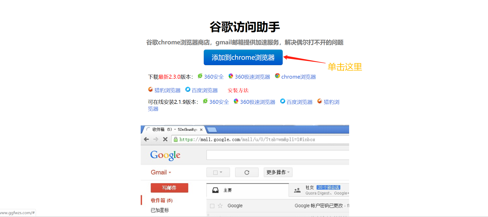
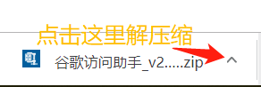
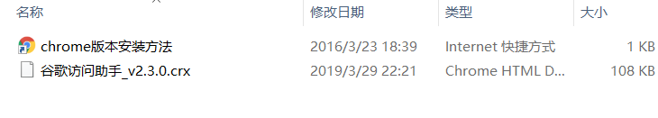
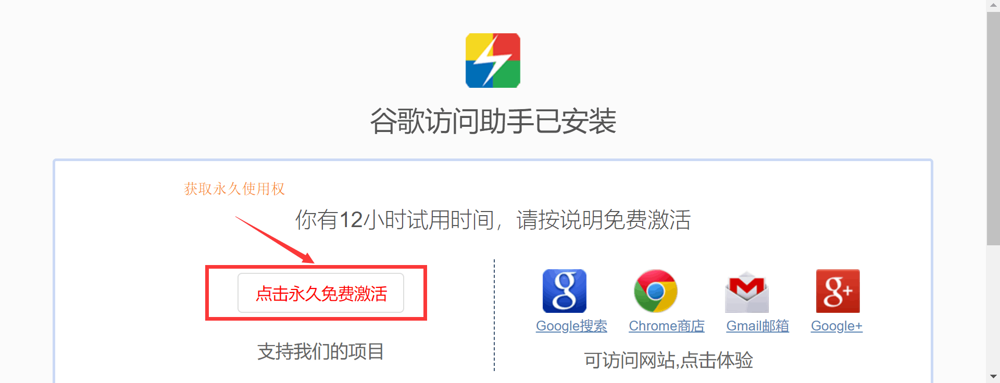
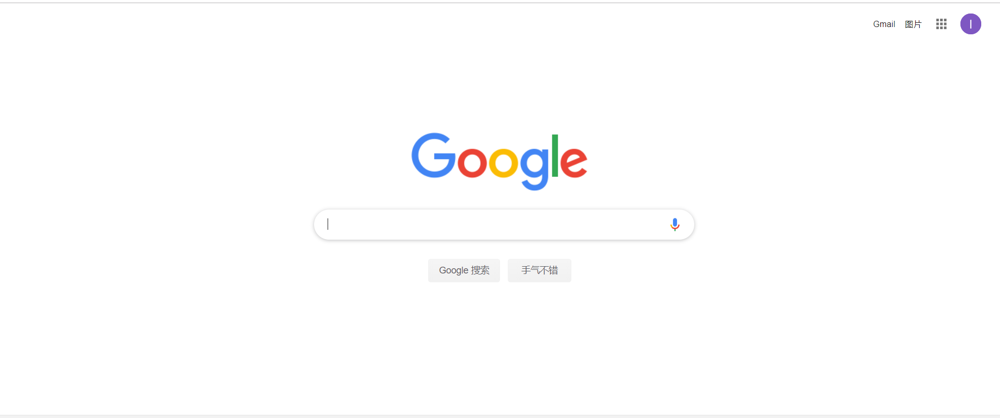
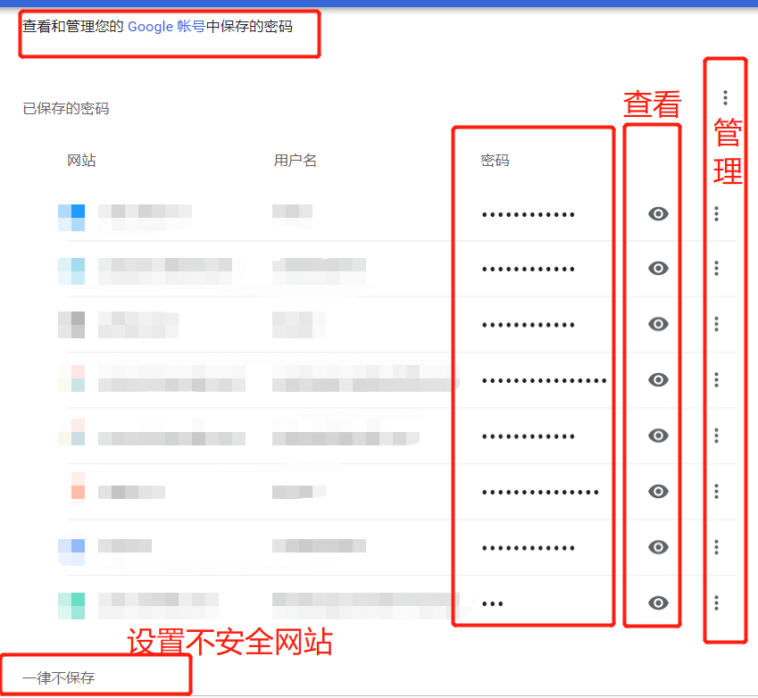
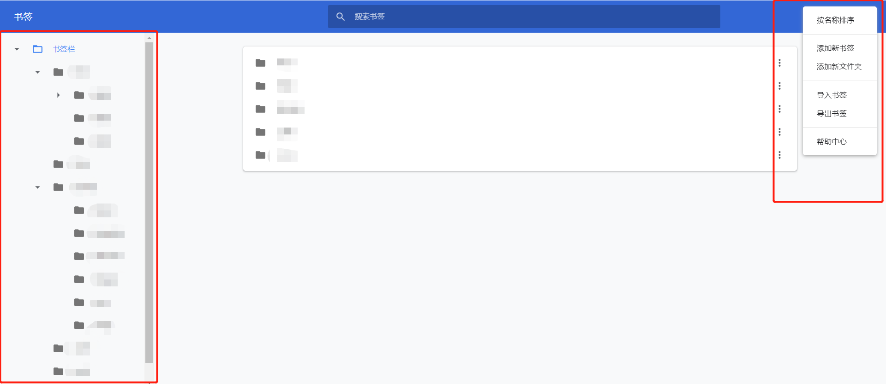

# 不需要VPN也能使用Google Search/Gmail/Shop

## 功能需要

google 搜索的话，常年被百度恶心到无话可说的我，用上了google，此处省略一万字不可描述。  另外，亲测可以进行 Google Scholar，对学生党而言非常方便了，想起来写论文导师要求外文+引文格式，因为无法上Google Scholar的痛苦与挣扎。

gmail 的话，有的时候注册很多东西需要一个gmail邮箱，同时gmail账号又可以方便管理你再chrome上的书签。

## 硬件需要

一台windows操作系统的，能够联网打开`www.baidu.com`页面的电脑。

## 软件需要

chrome 浏览器，Google厂家的产品自然需要绑定销售啊

## 步骤

step 1: 使用chrome浏览器打开这个链接 **`http://www.ggfwzs.com/`** 

页面如下：

step 2: 你将得到谷歌访问助手压缩包，见左下角（不出问题的话，出了问题你就去右上角找下载路径）

此处强烈安利`7-zip`解压缩软件，无毒无广告，以下链接自取：
>链接：https://pan.baidu.com/s/1hSvzRx1CY6h69kUMKKgdtw 
提取码：xwq9 

step 3: 解压缩软件，解压缩路径自己随意，获得`crx`文件和安装教程

自行双击打开`chrome版本安装方法`文件，按照教程安装。

step 4: 是的，步骤还没完呢。加入扩展程序之后会出现如下结果：

按照箭头所指进行永久免费激活吧。也就是设置一个打开浏览器首页。

## 使用

step 1: 赶紧[google](https://www.google.com)一下吧，希望你能成功！

step 2: 再注册个gmail账号吧，非常方便，然后右上角登录chrome浏览器，这样不仅能保存你登录网站的账号密码还能保存你保存的书签哦，chrome能对书签进行分文件夹管理。

  

step 3: Google Shop里面找个自己喜欢的chrome扩展程序吧。保证有你需要的一款。

## 最后

厚颜无耻求打赏呀！！！
如果你觉得有效的话，多多支持一下。

***最重要的是***，还想写个安卓端可以使用 `免费vpn` 访问 `Youtube` 的教程